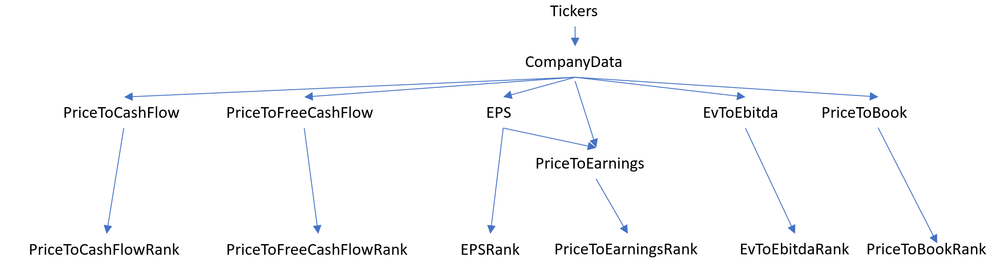
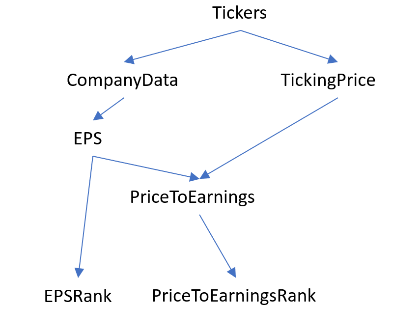
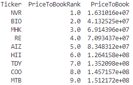

# Using Nodalize to rank the cheapest companies of the S&P500

## Purpose

Leveraging the **yfinance** package to download Yahoo Finance data, we will get financial data for all companies of the S&P500, compute our own accounting ratios and rank them from cheapest to most expensive.

This demo will show how to
- Use various calculation frameworks;
- Manage dependencies between nodes;
- Use polymorphism to quickly implement new nodes;
- Use templating to quickly instantiate new nodes without explicit implementation.


## Disclaimer

**The model and code below are for illustration only. We will not claim any kind of accuracy in the final data.**


## Imports

Here is the list of imports needed for the whole demo.

```python
from datetime import date

import numpy as np
import pandas as pd
import yfinance as yf
from pyarrow import csv

from nodalize.constants.column_category import ColumnCategory
from nodalize.data_management.sqlite_data_manager import SqliteDataManager
from nodalize.datanode import DataNode
from nodalize.dependency import DependencyDefinition
from nodalize.orchestration.coordinator import Coordinator
```

## Step 1: import tickers from local csv file using PyArrow

To simplify the demo, we will assume that the tickers are available in a csv file. We will use PyArrow to load them and persist in a table with a single column: "Ticker".

We only need to add 3 members to the class derived from DataNode:
- "calculator_type" to indicate that we want to use PyArrow;
- "schema" to define the columns in the persisted table;
- "compute" to implement the actual data gathering.

```python
class Tickers(DataNode):
    @property
    def calculator_type(self):
        return "pyarrow"

    @property
    def schema(self):
        return {
            "Ticker": (str, ColumnCategory.KEY),
        }

    def compute(self, parameters):
        tickers_path = ...
        return csv.read_csv(tickers_path)
```

Finally, we can build an instance of "Coordinator" and use it to compute the node and save the output data.

```python
coordinator = Coordinator("Demo")
coordinator.set_data_manager("sqlite", SqliteDataManager("TestDb/test.db"), default=True)
coordinator.create_data_node(Tickers)  # Add node to cache
coordinator.set_up()  # Build dependency graph
coordinator.compute_and_save("Tickers")  # Compute single node
```

## Step 2: load company data for these tickers, using yfinance and Pandas

This node will have a dependency to the "Tickers" one. This will be defined by the "dependencies" member, which returns a dictionary: the key is the name of the parameter to be passed to "compute" whilst the value is the name of the node to load.

In the "compute" function, the "tickers" parameter will be a lambda function to be called on demand. This function will load the data from the parent node.

```python
class CompanyData(DataNode):
    @property
    def calculator_type(self):
        return "pandas"

    @property
    def schema(self):
        return {
            "Ticker": (str, ColumnCategory.KEY),
            "Close": (float, ColumnCategory.VALUE),
            "Currency": (str, ColumnCategory.VALUE),
            "Volume": (float, ColumnCategory.VALUE),
            "MarketCap": (float, ColumnCategory.VALUE),
            "BookValue": (float, ColumnCategory.VALUE),
            "NetIncome": (float, ColumnCategory.VALUE),
            "SharesOutstanding": (float, ColumnCategory.VALUE),
            "OperatingCashFlow": (float, ColumnCategory.VALUE),
            "FreeCashFlow": (float, ColumnCategory.VALUE),
            "EnterpriseValue": (float, ColumnCategory.VALUE),
            "EBITDA": (float, ColumnCategory.VALUE),
        }

    @property
    def dependencies(self):
        return {"tickers": "Tickers"}

    def compute(self, parameters, tickers):
        tickers_df = tickers()

        tickers = []
        closes = []
        volumes = []
        market_caps = []
        currencies = []
        book_values = []
        net_incomes = []
        shares_outstandings = []
        free_cash_flows = []
        operating_cash_flows = []
        enterprise_values = []
        ebitda = []

        for ticker in tickers_df["Ticker"].tolist():
            ticker_proxy = yf.Ticker(ticker)
            data = ticker_proxy.info
            tickers.append(ticker)
            closes.append(data.get("previousClose"))
            volumes.append(data.get("volume"))
            market_caps.append(data.get("marketCap"))
            currencies.append(data.get("currency"))
            book_values.append(data.get("bookValue"))
            net_incomes.append(data.get("netIncomeToCommon"))
            shares_outstandings.append(data.get("sharesOutstanding"))
            free_cash_flows.append(data.get("freeCashflow"))
            operating_cash_flows.append(data.get("operatingCashflow"))
            enterprise_values.append(data.get("enterpriseValue"))
            ebitda.append(data.get("ebitda"))

        return pd.DataFrame(
            {
                "Ticker": tickers,
                "Close": closes,
                "Currency": currencies,
                "Volume": volumes,
                "MarketCap": market_caps,
                "BookValue": book_values,
                "NetIncome": net_incomes,
                "SharesOutstanding": shares_outstandings,
                "OperatingCashFlow": operating_cash_flows,
                "FreeCashFlow": free_cash_flows,
                "EnterpriseValue": enterprise_values,
                "EBITDA": ebitda,
            }
        )
```

Since the coordinator builds the dependency graph, it can cascade updates downstream.
The code below will run "Tickers" first, then "CompanyData".

```python
coordinator = Coordinator("Demo")
coordinator.set_data_manager("sqlite", SqliteDataManager("TestDb/test.db"), default=True)
coordinator.create_data_node(Tickers)
coordinator.CompanyData(Tickers)
coordinator.set_up()
coordinator.run_recursively(["Tickers"])
```


## Step 3: define ratio calculations using polymorphism

For each ratio, we want to load 2 fields from CompanyData, then divide one by the other, and finally persist in a table with 2 columns: "Ticker" and the ratio.
We will create a base class "AccountingRatio" to define the dependencies, data schema and calculations. The derived classes will simply define their numerators and denominators.

Note: within "dependencies" this is not the raw node name that we use but the DependencyDefinition class instead. This allows us to provide more information about what to load and how. In our case, we will set what columns from "CompanyData" we are interested in ("Ticker", numerator, denominator).

```python
class AccountingRatio(DataNode):
    @property
    def calculator_type(self):
        return "pandas"

    @property
    def numerator(self):
        raise NotImplementedError

    @property
    def denominator(self):
        raise NotImplementedError

    @property
    def schema(self):
        return {
            "Ticker": (str, ColumnCategory.KEY),
            self.__class__.__name__: (float, ColumnCategory.VALUE),
        }

    @property
    def dependencies(self):
        return {
            "data": DependencyDefinition(
                "CompanyData",
                data_fields={
                    c: c for c in ["Ticker", self.numerator, self.denominator]
                },
            )
        }

    def compute(self, parameters, data):
        data = data()
        data[self.__class__.__name__] = data[self.numerator] / data[self.denominator]
        return data

```

Now that we have our base class, we can define our ratios very quickly by simply defining the operator and numerator.

```python
class EPS(AccountingRatio):
    @property
    def numerator(self):
        return "NetIncome"

    @property
    def denominator(self):
        return "SharesOutstanding"


class PriceToCashFlow(AccountingRatio):
    @property
    def numerator(self):
        return "Close"

    @property
    def denominator(self):
        return "OperatingCashFlow"


class PriceToFreeCashFlow(AccountingRatio):
    @property
    def numerator(self):
        return "Close"

    @property
    def denominator(self):
        return "FreeCashFlow"


class EvToEbitda(AccountingRatio):
    @property
    def numerator(self):
        return "EnterpriseValue"

    @property
    def denominator(self):
        return "EBITDA"


class PriceToBook(AccountingRatio):
    @property
    def numerator(self):
        return "EnterpriseValue"

    @property
    def denominator(self):
        return "BookValue"
```

## Dependency management

Let us create a "PriceToEarnings" node, to be derived from the close price and the earnings per share (EPS). For this, we need the output of the "EPS" node and from the "CompanyData" node.

```python
class PriceToEarnings(DataNode):
    @property
    def calculator_type(self):
        return "pandas"

    @property
    def schema(self):
        return {
            "Ticker": (str, ColumnCategory.KEY),
            "PriceToEarnings": (float, ColumnCategory.VALUE),
        }

    @property
    def dependencies(self):
        return {
            "data": DependencyDefinition(
                "CompanyData", data_fields={c: c for c in ["Ticker", "Close"]}
            ),
            "eps": DependencyDefinition(
                "EPS", data_fields={c: c for c in ["Ticker", "EPS"]}
            ),
        }

    def compute(self, parameters, data, eps):
        data = data()
        eps = eps()
        merged_data = pd.merge(data, eps, how="inner", on="Ticker")
        merged_data["PriceToEarnings"] = merged_data["Close"] / merged_data["EPS"]
        return merged_data
```

Thus, "PriceToEarnings" depends on "CompanyData" and "EPS", but "EPS" also depends on "CompanyData".
When asked to compute the 3 nodes together, Nodalize will build the dependency graph and compute the nodes each once and in the right order.

Note: the "compute" function performs a join of 2 Pandas dataframes and is thus tightly bound to using Pandas. The DataNode class offers some built-in function to abstract such common treatments:
- DataNode.column: returns the "column" object, which can then be used with basic operators
- DataNode.add: to add the newly created column to the dataframe
- DataNode.join: to join 2 dataframes together

Then the "compute" function could be rewritten as

```python
    def compute(self, parameters, data, eps):
        data = data()
        eps = eps()
        merged_data = self.join(data, eps, how="inner", on=("Ticker", "Ticker))
        priceToEarnings = self.column(merged_data, "Close") / self.column(merged_data, "EPS")
        merged_data = self.add(merged_data, "PriceToEarnings", priceToEarnings)
        return merged_data
```

With such a definition, PriceToEarnings could be run using either PyArrow, Pandas, Dask, Polars or PySpark, without further code change.

## Step 4: define ranks using a template

We want to attribute a rank to the companies for each ratio. This could be achieved using polymorphism again, but let us do it using a single generic class "Rank".

By default, the node identifier is inferred from the class name, but this can be overridden. The example below will take a ratio name as parameter of the initializer, which will be reused to determine
- the node identifier;
- the dependency;
- the name of the column in the table.

```python
class Rank(DataNode):
    @property
    def calculator_type(self):
        return "pandas"

    def __init__(self, calculator_factory, data_manager_factory, ratio_name, **kwargs):
        self._ratio_name = ratio_name
        super().__init__(data_manager, calculator_factory, data_manager_factory, **kwargs)

    @property
    def identifier(self):
        return self._ratio_name + "Rank"

    @property
    def schema(self):
        return {
            "Ticker": (str, ColumnCategory.KEY),
            self._ratio_name + "Rank": (float, ColumnCategory.VALUE),
        }

    @property
    def dependencies(self):
        return {"ratio": self._ratio_name}

    def compute(self, parameters, ratio):
        df = ratio(ignore_deltas=True)
        df[self._ratio_name] = np.where(
            df[self._ratio_name] < 0, np.NAN, df[self._ratio_name]
        )
        df[self._ratio_name + "Rank"] = np.trunc(df[self._ratio_name].rank())
        return df
```

The kwargs of the "coordinator.create_data_node" function will be passed to the initializer. Thus, "Coordinator" can be used as a factory.

```python
coordinator.create_data_node(Rank, ratio_name="PriceToEarnings")  # Create PriceToEarningsRank node
coordinator.create_data_node(Rank, ratio_name="PriceToCashFlow")  # Create PriceToCashFlowRank node
coordinator.create_data_node(Rank, ratio_name="PriceToFreeCashFlow")  # Create PriceToFreeCashFlowRank node
coordinator.create_data_node(Rank, ratio_name="EvToEbitda")  # Create EvToEbitdaRank node
coordinator.create_data_node(Rank, ratio_name="PriceToBook")  # Create PriceToBookRank node
```

## Computing all

We know how to register all these nodes and compute recursively. The instance of "Coordinator" will be initialised as follows.

```python
coordinator = Coordinator("test")
coordinator.set_data_manager("sqlite", SqliteDataManager("TestDb/test.db"), default=True)
coordinator.create_data_node(Tickers)
coordinator.create_data_node(CompanyData)
coordinator.create_data_node(EPS)
coordinator.create_data_node(PriceToEarnings)
coordinator.create_data_node(PriceToCashFlow)
coordinator.create_data_node(PriceToFreeCashFlow)
coordinator.create_data_node(EvToEbitda)
coordinator.create_data_node(PriceToBook)
coordinator.create_data_node(Rank, ratio_name="PriceToEarnings")
coordinator.create_data_node(Rank, ratio_name="PriceToCashFlow")
coordinator.create_data_node(Rank, ratio_name="PriceToFreeCashFlow")
coordinator.create_data_node(Rank, ratio_name="EvToEbitda")
coordinator.create_data_node(Rank, ratio_name="PriceToBook")
cheapest = coordinator.create_data_node(CheapestTickers)
coordinator.set_up()
```

The last statement will build the following dependency graph.



To compute all, we just need to call "run_recursively" on the "Ticker" node.

```python
coordinator.run_recursively(node_identifiers=["Tickers"], global_parameters={"DataDate": date(2023, 4, 14)})
```

## Delta updates

By default, only the delta updates are cascaded through the graph. Let us illustrate through a scenario: instead of using the close price from CompanyData, we use some ticking price source.



Here is the new definition for "PriceToEarnings".

```python
class PriceToEarnings(DataNode):
    @property
    def calculator_type(self):
        return "pandas"

    @property
    def schema(self):
        return {
            "Ticker": (str, ColumnCategory.KEY),
            "PriceToEarnings": (float, ColumnCategory.VALUE),
        }

    @property
    def dependencies(self):
        return {
            "price": "TickingPrice",
            "eps": DependencyDefinition(
                "EPS", data_fields={c: c for c in ["Ticker", "EPS"]}
            ),
        }

    def compute(self, parameters, price, eps):
        merged_data = pd.merge(price(), eps(), how="inner", on="Ticker")
        merged_data["PriceToEarnings"] = merged_data["Price"] / merged_data["EPS"]
        return merged_data
```


The "TickingPrice" node will only return the updated prices since the last run. Let us suppose that an intraday run refreshes only the prices for tickers "A", "B" and "C". Here is what will happen:

1. TickingPrice "compute" function returns a DataFrame with 3 records for tickers "A", "B" and "C".
2. Nodalize will only update the prices for these tickers into the TickingPrice table.
3. Then "PriceToEarnings" will run: the "price()" call within "compute" will return only the 3 updated prices.
4. The inner join will return only 3 records: tickers "A", "B" and "C" with their prices and EPS.
5. Nodalize will update the 3 ratios in the PriceToEarnings table.
6. Then "PriceToEarningsRank" will run.

Remember the implementation of the "compute" function in the "Rank" class.

```python
def compute(self, parameters, ratio):
        df = ratio(ignore_deltas=True)
        df[self._ratio_name] = np.where(
            df[self._ratio_name] < 0, np.NAN, df[self._ratio_name]
        )
        df[self._ratio_name + "Rank"] = np.trunc(df[self._ratio_name].rank())
        return df
```

The "ignore_deltas" parameter passed to the "ratio" function is to force loading all data, not only what has been updated upstream. In that way, the rank calculation will load the ratios for all tickers, not only those which received a new price, which is necessary to refresh the ranks accurately.

## Loading data

The instances of DataNode can be used as API to retrieve the data saved.

```python
data = my_node.load(columns=..., filters=...)
```

The "filters" parameter follows the same convention as the ParquetDataset class from PyArrow. See https://arrow.apache.org/docs/python/generated/pyarrow.parquet.ParquetDataset.html


```python
priceToBook = coordinator.get_data_node("PriceToBook")
priceToBookDf = priceToBook.load(columns=["Ticker", "PriceToBook"])

priceToBookRank = coordinator.get_data_node("PriceToBookRank")
rankDf = priceToBookRank.load(columns=["Ticker", "PriceToBookRank"], filters=[[("DataDate", "=", date(2023, 4, 14)), ("PriceToBookRank", "<", 10)]])

data = pd.merge(rankDf, priceToBookDf, how="inner", on="Ticker").sort_values(by="PriceToBookRank")
print(data)
```


