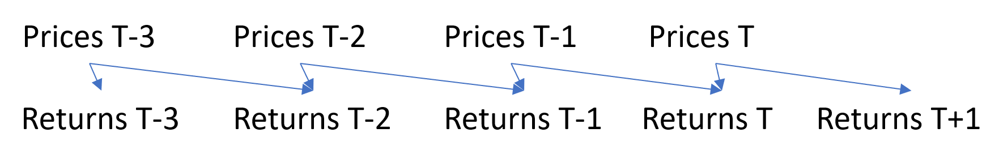

# Using Nodalize to compute market betas for all S&P500

## Purpose

Leveraging the **yfinance** package to download Yahoo Finance data, we will get prices for all companies of the S&P500, compute the daily returns and infer their betas.

This demo will show how to deal with time dependencies and time series.


## Disclaimer

**The model and code below are for illustration only. We will not claim any kind of accuracy in the final model and data.**


## Imports

Here is the list of imports needed for the demo.

```python
from abc import ABC
from datetime import date, timedelta

import numpy as np
import pandas as pd
import yfinance as yf

from nodalize.constants.column_category import ColumnCategory
from nodalize.custom_dependencies.lag import WeekDayLagDependency
from nodalize.custom_dependencies.window import WindowDependency
from nodalize.data_management.kdb_data_manager import KdbDataManager
from nodalize.datanode import DataNode
from nodalize.orchestration.coordinator import Coordinator
```

## Step 0: common base class

Because we don't like to repeat ourselves, we will create an abstract base class to define the common calculator (Pandas) and the common key columns.

```python
class PandasNode(ABC, DataNode):
    @property
    def calculator_type(self):
        return "pandas"

    @property
    def value_columns(self):
        """Define value columns to be added to the schema."""
        return {}

    @property
    def schema(self):
        keys = {"Ticker": (str, ColumnCategory.KEY)}
        final_schema = {**keys, **self.value_columns}
        return final_schema
```

Thus, to define the specific schemas, we will only define the "value_columns" property on the derived class, without having to define the "Tickers" columns again.

## Step 1: import tickers from local csv file

To simplify the demo, we will assume that the tickers are available in a csv file. We will use Pandas to load them and persist in a table with a single column: "Ticker".
See previous demo for details: [Load company data from Yahoo Finance API and compute accounting ratios before ranking by values](accounting_ratios.md)

```python
class Tickers(PandasNode):
    def compute(self, parameters):
        tickers_path = ...
        return pd.read_csv(tickers_path)
```

## Step 2: import prices

To compute the stock returns, we need the prices adjusted for dividend payments and stock splits. This is available through the Yahoo finance API and *yfinance* package as "Adj Close".

The default behaviour of our node will be to load the prices for the specified date. However, there will be a specific "backfill" mode to load and persist the prices for the past year. This "mode" is passed to the calculation via the "parameters" dictionary.

```python
class AdjustedPriceClose(PandasNode):
    @property
    def dependencies(self):
        return {"tickers": "Tickers"}

    @property
    def value_columns(self):
        return {"Price": (float, ColumnCategory.VALUE)}

    def compute(self, parameters, tickers):
        tickers_df = tickers()
        tickers = tickers_df["Ticker"].tolist()
        tickers.append("^GSPC")  # S&P500

        end_dt = parameters["DataDate"]

        if parameters.get("mode") == "backfill":
            start_dt = end_dt - timedelta(365)
        else:
            start_dt = end_dt

        raw_data = yf.download(
            tickers=" ".join(tickers),
            start=start_dt.strftime("%Y-%m-%d"),
            end=end_dt.strftime("%Y-%m-%d"),
            interval="1d",
        )

        columns = [("Adj Close", t) for t in tickers]
        raw_data = raw_data[columns]
        raw_data.columns = raw_data.columns.droplevel()
        final_data = raw_data.reset_index().melt(id_vars=["Date"], value_vars=tickers)
        final_data.columns = ["DataDate", "Ticker", "Price"]
        return final_data
```

We can then load and persist the prices for the 365 days using such code:

```python
coordinator = Coordinator("test")
coordinator.set_data_manager("kdb", KdbDataManager(None, "localhost", 5000, lambda: (None, None)), default=True)
coordinator.create_data_node(Tickers)
coordinator.create_data_node(AdjustedPriceClose)
coordinator.set_up()

coordinator.run_recursively(
    node_identifiers=["Tickers"],
    global_parameters={"DataDate": date(2023, 5, 25)},
    specific_parameters={"AdjustedPriceClose": {"mode": "backfill"}}
)
```

The "global_parameters" will be passed to every node, whilst the "specific_parameters" will be used only for the node represented by the key in the dictionary. The specific parameters take precedence over the global parameters.

Note: the expected inputs for the KdbDataManager are
- KDB namespace (can be null)
- host name
- port number
- function returning user and password

## Step 2: compute the daily returns

Our return node will have 2 dependencies:
- current prices
- lagged prices

For the lagged prices, we can use the *LagDependency* class. By default, this class does not use any calendar, thus the lagged date may fall on a bank holiday or a weekend.

```python
class Return(PandasNode):
    @property
    def dependencies(self):
        return {"priceT": "AdjustedPriceClose", "priceTMinus1": LagDependency("AdjustedPriceClose", day_lag=1, data_fields={"Ticker": "Ticker", "Price": "LaggedPrice"})}
    
    @property
    def value_columns(self):
        return {
            "Return": (float, ColumnCategory.VALUE)
            }

    def compute(self, parameters, priceT, priceTMinus1):
        df = priceT()
        lagged = priceTMinus1()
        df = pd.merge(df, lagged, on="Ticker", how="inner")
        df["Return"] = (df["Price"] - df["LaggedPrice"]) / df["LaggedPrice"]
        return df
```

To look back to previous week days, we have 3 options:
1. Use the "lookback" parameter of *LagDependency*, for example with the value 2. When the lagged date falls on a Sunday, the *LagDependency* will look for the latest available data within the previous 2 days. However, this approach would also make the *LagDependency* load previous data if the prices were simply missing on a week day for whatever reason.
2. Use our own dependency class, implementing a calendar.
3. Use the *WeekDayLagDependency* class: when a date was moved to a Saturday or Sunday, the class will shift the date to the previous Friday.

To illustrate how to implement a custom *LagDependency* class, we will show the actual implementation of WeekDayLagDependency.

```python
class WeekDayLagDependency(LagDependency):
    def offset_days(self, dt: date, offset: int) -> date:
        if offset == 0:
            return dt

        new_date = dt + timedelta(offset)

        if new_date.weekday() == 5:
            if offset > 0:
                return new_date + timedelta(2)
            else:
                return new_date - timedelta(1)
        elif new_date.weekday() == 6:
            if offset > 0:
                return new_date + timedelta(1)
            else:
                return new_date - timedelta(2)
        else:
            return new_date
```

It will be easy to integrate some calendar management: derive the *LagDependency* class, load the calendar from somewhere into the initializer, finally override the "offset_days" method.

### Calculation cascading

To generate prices and returns, we can run the following code.

```python
coordinator = Coordinator("test")
coordinator.set_data_manager("kdb", KdbDataManager(None, "localhost", 5000, lambda: (None, None)), default=True)
coordinator.create_data_node(Tickers)
coordinator.create_data_node(AdjustedPriceClose)
coordinator.create_data_node(Return)
coordinator.set_up()

coordinator.run_recursively(
    node_identifiers=["AdjustedPriceClose"],
    global_parameters={"DataDate": date(2023, 5, 25)},
    specific_parameters={"AdjustedPriceClose": {"mode": "backfill"}}
)
```

The "backfill" mode for AdjustedPriceClose will load all prices for the last year. Then the coordinator will take care of finding the tickers and dates impacted, and will cascade accordingly.



Note: the coordinator will not compute each date twice because of the update of 2 upstream dependencies. Instead, it will remove the duplicates from the list of dates/nodes to recompute before proceeding.

This implementation of Return will force the coordinator to run the compute method once for each date. Instead, we could compute the prices and returns separately, without recursion, and add a "backfill" mode to the Return class, to improve the performance.

```python
class Return(PandasNode):
    @property
    def dependencies(self):
        return {
            "priceT": "AdjustedPriceClose",
            "priceTMinus1": WeekDayLagDependency(
                "AdjustedPriceClose",
                day_lag=1,
                data_fields={"Ticker": "Ticker", "Price": "LaggedPrice"},
            ),
        }

    @property
    def value_columns(self):
        return {
            "Return": (float, ColumnCategory.VALUE),
        }

    def compute(self, parameters, priceT, priceTMinus1):
        df = priceT()
        lagged = priceTMinus1()
        df = pd.merge(df, lagged, on="Ticker", how="inner")
        df["Return"] = (df["Price"] - df["LaggedPrice"]) / df["LaggedPrice"]
        return df

coordinator = Coordinator("test")
coordinator.set_data_manager("kdb", KdbDataManager(None, "localhost", 5000, lambda: (None, None)), default=True)
coordinator.create_data_node(Tickers)
coordinator.create_data_node(AdjustedPriceClose)
coordinator.create_data_node(Return)
coordinator.set_up()

coordinator.compute_and_save("AdjustedPriceClose")  # Compute single node
coordinator.compute_and_save("Return")  # Compute single node
```

## Step 3: betas

To compute the market betas, we want to load all returns for the past year.

### Option 1: custom query to the database

We can simply run our own query and load any data we want. The declared dependency will only be used to build the dependency graph and cascade the calculations.

```python
class BetaWithDirectQuery(PandasNode):
    @property
    def dependencies(self):
        return {"returns": "Return"}
    
    @property
    def value_columns(self):
        return {
            "Beta": (float, ColumnCategory.VALUE)
            }
           
    def compute(self, parameters, returns):
        end = parameters["DataDate"]
        start = end - timedelta(365)

        kdb_query = f"""
select DataDate, Ticker, Return
from Return 
where InsertedDatetime=(max;InsertedDatetime) fby ([]Ticker;DataDate), DataDate>={start.strftime("%Y.%m.%d")}, DataDate<={end.strftime("%Y.%m.%d")}
"""

        # self.data_manager will return the KDB loader
        all_returns = self.data_manager.load_data_frame_from_query(
            self.calculator, kdb_query, schema={"Ticker": str, "Return": float, "DataDate": date}
        )

        s_and_p_returns = all_returns.loc[all_returns["Ticker"] == "^GSPC", "Return"]
        s_and_p_var = np.var(s_and_p_returns.to_numpy())

        tickers = [t for t in all_returns["Ticker"].unique() if t != "^GSPC"]
        all_returns = all_returns.pivot(index="DataDate", columns="Ticker", values="Return")

        betas = {}
        # Compute beta as cov(S&P500, ticker) / var(S&P500)
        for t in tickers:
            cov = np.cov(all_returns["^GSPC"], all_returns[t])[0][1]
            beta = cov / s_and_p_var
            betas[t] = beta

        ret = pd.DataFrame({
            "Ticker": list(betas.keys()),
            "Beta": list(betas.values())
        })

        return ret
```

### Option 2: use the WindowDependency class

This type of dependency will load the data for a range of dates, but will cascase calculations only for the same DataDate.
For instance, a refresh of the returns for date T could impact all betas from the range [T, T+365], but the WindowDependency class will only cascade to T.

```python
class BetaWithWindowDependency(PandasNode):
    @property
    def dependencies(self):
        return {"returns": WindowDependency("Return", start_day_offset=-365)}
    
    @property
    def value_columns(self):
        return {
            "Beta": (float, ColumnCategory.VALUE)
            }
           
    def compute(self, parameters, returns):
        all_returns = returns()

        s_and_p_returns = all_returns.loc[all_returns["Ticker"] == "^GSPC", "Return"]
        s_and_p_var = np.var(s_and_p_returns.to_numpy())

        tickers = [t for t in all_returns["Ticker"].unique() if t != "^GSPC"]
        all_returns = all_returns.pivot(index="DataDate", columns="Ticker", values="Return")

        betas = {}
        for t in tickers:
            cov = np.cov(all_returns["^GSPC"], all_returns[t])[0][1]
            beta = cov / s_and_p_var
            betas[t] = beta

        ret = pd.DataFrame({
            "Ticker": list(betas.keys()),
            "Beta": list(betas.values())
        })

        return ret
```

### Final code

```python
import os
from abc import ABC
from datetime import date, timedelta

import numpy as np
import pandas as pd
import yfinance as yf

from nodalize.constants.column_category import ColumnCategory
from nodalize.custom_dependencies.lag import WeekDayLagDependency
from nodalize.custom_dependencies.window import WindowDependency
from nodalize.data_management.kdb_data_manager import KdbDataManager
from nodalize.datanode import DataNode
from nodalize.orchestration.coordinator import Coordinator


class PandasNode(ABC, DataNode):
    @property
    def calculator_type(self):
        return "pandas"

    @property
    def value_columns(self):
        return {}

    @property
    def schema(self):
        keys = {"Ticker": (str, ColumnCategory.KEY)}
        final_schema = {**keys, **self.value_columns}
        return final_schema


class Tickers(PandasNode):
    def compute(self, parameters):
        tickers_path = os.path.join(
            os.path.dirname(os.path.abspath(__file__)), "tickers.csv"
        )
        return pd.read_csv(tickers_path)


class AdjustedPriceClose(PandasNode):
    @property
    def dependencies(self):
        return {"tickers": "Tickers"}

    @property
    def value_columns(self):
        return {"Price": (float, ColumnCategory.VALUE)}

    def compute(self, parameters, tickers):
        tickers_df = tickers()
        tickers = tickers_df["Ticker"].tolist()
        tickers.append("^GSPC")  # S&P500

        end_dt = parameters["DataDate"]

        if parameters.get("mode") == "backfill":
            start_dt = end_dt - timedelta(365)
        else:
            start_dt = end_dt

        raw_data = yf.download(
            tickers=" ".join(tickers),
            start=start_dt.strftime("%Y-%m-%d"),
            end=end_dt.strftime("%Y-%m-%d"),
            interval="1d",
        )

        columns = [("Adj Close", t) for t in tickers]
        raw_data = raw_data[columns]
        raw_data.columns = raw_data.columns.droplevel()
        final_data = raw_data.reset_index().melt(id_vars=["Date"], value_vars=tickers)
        final_data.columns = ["DataDate", "Ticker", "Price"]
        return final_data


class Return(PandasNode):
    @property
    def dependencies(self):
        return {
            "priceT": "AdjustedPriceClose",
            "priceTMinus1": WeekDayLagDependency(
                "AdjustedPriceClose",
                day_lag=1,
                data_fields={"Ticker": "Ticker", "Price": "LaggedPrice"},
            ),
        }

    @property
    def value_columns(self):
        return {
            "Return": (float, ColumnCategory.VALUE),
        }

    def compute(self, parameters, priceT, priceTMinus1):
        df = priceT()
        lagged = priceTMinus1()
        df = pd.merge(df, lagged, on="Ticker", how="inner")
        df["Return"] = (df["Price"] - df["LaggedPrice"]) / df["LaggedPrice"]
        return df


class Beta(PandasNode):
    @property
    def dependencies(self):
        return {"returns": WindowDependency("Return", start_day_offset=-365)}

    @property
    def value_columns(self):
        return {"Beta": (float, ColumnCategory.VALUE)}

    def compute(self, parameters, returns):
        all_returns = returns()

        s_and_p_returns = all_returns.loc[all_returns["Ticker"] == "^GSPC", "Return"]
        s_and_p_var = np.var(s_and_p_returns.to_numpy())

        tickers = [t for t in all_returns["Ticker"].unique() if t != "^GSPC"]
        all_returns = all_returns.pivot(
            index="DataDate", columns="Ticker", values="Return"
        )

        betas = {}
        for t in tickers:
            cov = np.cov(all_returns["^GSPC"], all_returns[t])[0][1]
            beta = cov / s_and_p_var
            betas[t] = beta

        ret = pd.DataFrame({"Ticker": list(betas.keys()), "Beta": list(betas.values())})

        return ret


coordinator = Coordinator("test")
coordinator.set_data_manager("kdb", KdbDataManager(None, "localhost", 5000, lambda: (None, None)), default=True)
coordinator.create_data_node(Tickers)
coordinator.create_data_node(AdjustedPriceClose)
coordinator.create_data_node(Return)
coordinator.create_data_node(Beta)
coordinator.set_up()

coordinator.run_recursively(
    node_identifiers=["Tickers"],
    global_parameters={"DataDate": date(2023, 5, 25)},
    specific_parameters={"AdjustedPriceClose": {"mode": "backfill"}},
)


print(coordinator.get_data_node("Beta").load())

```